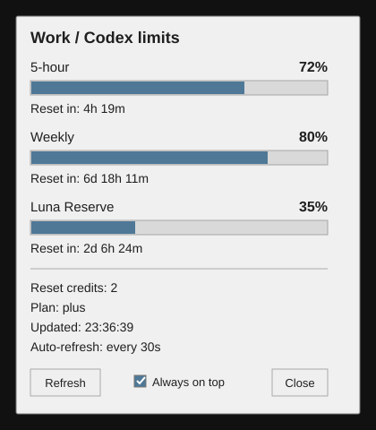

# Work Limits Monitor for Windows

[](https://github.com/PavelNikolenko/work-limits-monitor-windows/actions/workflows/windows-smoke.yml)

Неофициальная компактная Windows-утилита для отображения лимитов Codex.

[English version](README.md)

> Текущая версия: 0.2.0

## Зачем это нужно

При активной работе с Codex или ChatGPT Work постоянно возникает простой вопрос: сколько доступного ресурса осталось прямо сейчас?

Work Limits Monitor держит лимиты в небольшом окне Windows, которое можно оставить поверх рабочих окон.

Показывает:

- остаток 5-часового лимита;
- остаток недельного лимита;
- Luna Reserve, если этот резерв возвращает локальный сервис Codex;
- время до сброса каждого отображаемого окна;
- доступные reset credits;
- тип плана;
- автоматическое обновление каждые 30 секунд.

Строка Luna Reserve показывает состояние отдельного резервного пула. Само её наличие или значение не доказывает, что конкретная задача в этот момент выполняется на Luna.

Утилита не запускает задачи ChatGPT Work, не отправляет промпты, не изменяет чаты и не расходует reset credits.

## Что изменилось в 0.2.0

Изменение появилось из практического использования. После исчерпания основного лимита и перехода на Luna Reserve стало очевидно, что монитор показывает стандартные 5-часовой и недельный лимиты, но не показывает резерв, который фактически приходится контролировать.

В версии 0.2.0 добавлены отдельная шкала Luna Reserve и обратный отсчёт до её сброса. Также исправлен размер окна: оно автоматически увеличивается по высоте при добавлении новых строк и допускает ручное изменение высоты.

Подробности: [RELEASE_NOTES_0.2.0.md](RELEASE_NOTES_0.2.0.md) и [CHANGELOG.md](CHANGELOG.md).

## Вид интерфейса



*Предпросмотр версии 0.2.0 с тестовыми значениями. Фактические значения и доступные строки берутся из вашей локальной сессии Codex.*

## Как это работает

Программа запускает установленный локально Codex CLI в режиме app-server и читает состояние лимитов методом:

`account/rateLimits/read`

Для обнаружения Luna Reserve запрос включает соответствующую возможность локального сервиса.

Это неофициальная пользовательская утилита. Интерфейс Codex app-server может измениться в будущих версиях Codex.

## Требования

- Windows 10 или Windows 11
- Python 3.10 или новее
- Codex CLI в `PATH`
- выполненный вход в Codex CLI

Сторонние Python-пакеты не требуются.

## Установка

В PowerShell из папки репозитория:

```powershell
cd path\to\work-limits-monitor-windows
.\install\install.ps1
```

Установщик:

1. проверяет Python и Codex CLI;
2. копирует программу в `%LOCALAPPDATA%\WorkLimitsMonitor`;
3. создаёт ярлык `Work Limits Monitor` на рабочем столе;
4. добавляет программу в автозагрузку текущего пользователя Windows;
5. запускает монитор.

## Конфиденциальность

В опубликованном коде нет идентификаторов аккаунта, conversation ID, email, локальных имён пользователей, фиксированных пользовательских путей или данных основного частного проекта.

Программа только читает лимиты из локально авторизованного Codex CLI и не отправляет телеметрию или историю использования.

## Ограничения

- Используется локальный интерфейс Codex app-server, который может измениться.
- Утилита показывает значения окон лимитов, а не количество токенов.
- Проценты 5-часового, недельного и Luna Reserve окон не являются балансом токенов.
- Luna Reserve показывает состояние резерва, а не фактический маршрут текущей модели.

## Безопасность

См. [SECURITY.md](SECURITY.md).

## Лицензия

MIT. См. [LICENSE](LICENSE).

## Поддержка проекта

Если утилита избавляет вас от постоянного открытия страницы лимитов ChatGPT, поставьте репозиторию звезду.

Также можно добровольно поддержать проект через Ko-fi:

https://ko-fi.com/pavelnikolenko
